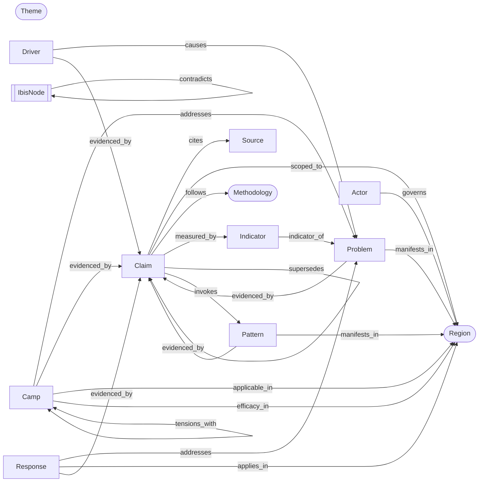

# Schema design — Aotearoa migration (Layer 1a)

Status: **Gate-closed 2026-04-25** — all nine §5 open decisions ratified; Opus gate complete (`docs/SCHEMA-DESIGN-aotearoa-gate-2026Q2.md`); notation cleanup pass complete (Layer 1a-cleanup). Layer 1b is unblocked.
Inputs: `docs/MIGRATION-auckland-to-aotearoa.md` §§ 1, 2, 5; all 8 files in `content/auckland/schema/`; `content/auckland/tools/lint.py`; `content/auckland/tools/graph.py`.
Output of this layer: this document — entity inventory, edge inventory, cross-entity invariants as first-order predicates, methodology registry seed.
Out of scope this session (per Layer 1b / 1c): JSON Schema bodies, Pydantic models, `invariants.py` implementation. The predicates below are the spec the JSON Schema and Python invariants will discharge.

---

## 0. Notation

The knowledge base is a typed multigraph

$$ G = (V, E, \tau, \lambda) $$

with vertex set $V$ partitioned by a typing function $\tau \colon V \to \mathcal{T}$ where $\mathcal{T}$ is the entity-type alphabet defined in §1; edge set $E \subseteq V \times V$ partitioned by an edge-typing function $\lambda \colon E \to \mathcal{R}$ where $\mathcal{R}$ is the edge-type alphabet defined in §2. Where convenient, $V_T := \{v \in V : \tau(v) = T\}$ and $E_r := \{e \in E : \lambda(e) = r\}$.

Cross-entity invariants are stated as first-order formulas over $G$. JSON Schema discharges intra-entity constraints (cardinalities, regex on identifier patterns, enum closure); Python predicates in `content/_schema/invariants.py` discharge cross-entity constraints — the bar a JSON Schema validator cannot clear.

A **role** is a label attached to an *edge*, not a *node*. Per ratified decision §5.5 of `CLAUDE.md`, evidence is no longer a node type; the role "evidence" is carried by edges $E_{\mathrm{evidenced\_by}}$ and $E_{\mathrm{cites}}$.

For any attribute name $a$ defined on entity type $T$, $a : V_T \to \mathrm{val}(a)$ projects the YAML field; $\mathrm{val}(a)$ is the field's co-domain (string, integer, set, etc.). The function $\mathrm{refs} : V \to 2^{\mathrm{IdString}}$ collects all ID-valued attribute references:

$$\mathrm{refs}(v) := \bigcup_{a \in \mathrm{IdAttrs}(\tau(v))} a(v)$$

where $\mathrm{IdAttrs}(T)$ is the finite, type-specific set of attributes whose co-domain is an identifier string or list of identifier strings, as enumerated in the JSON Schema for type $T$.

---

## 1. Entity inventory $\mathcal{T}$

Thirteen entity types. Three are first-class **referent** types (Region, Theme, Methodology) — closed enumerations whose members are rarely added but heavily referenced. Eight are **substantive** types whose instances are the primary content. Two are **structural** (IbisNode, Pattern) — they have content but their semantics derive from their position in the graph.

| Type | Role | Cardinality (v1) | Region parameter | Comes from |
|---|---|---|---|---|
| `Region` | referent | 16 regions + `nz`; optionally + 67 TAs | self | new |
| `Theme` | referent | ~11 (housing, transport, infrastructure, environment, inequality, crime, health, education, economy, governance, climate-adaptation) | n/a | new |
| `Methodology` | referent | seeded ≈12 (this doc, §4); grows | n/a | new |
| `Source` | substantive | hundreds → thousands | `geo_granularity: Set` | Auckland (kept; flag-extended) |
| `Claim` | substantive | thousands | `scoped_to: list[Region]` (≥1) | renamed from Auckland `evidence` |
| `Pattern` | structural | dozens → low hundreds | `manifests_in: list[Region]` (≥2) | new |
| `Problem` | substantive | hundreds | `manifests_in: list[Region]` (≥1) | Auckland (kept) |
| `Driver` | substantive | hundreds | `intensity_by_region: dict[Region, ℝ]` (optional); plus `scope` enum | Auckland (kept) |
| `Camp` | substantive | low hundreds | `applicable_in → Region` (edge), `efficacy_in → Region` (edge) — see §2 | Auckland (extended) |
| `Indicator` | substantive | low hundreds | `geography` (Auckland-style); plus `granularities_supported` | renamed from Auckland `metric` |
| `Actor` | substantive | hundreds | governs ≥0 Regions via edge | Auckland (kept; widened) |
| `Response` | substantive | hundreds | `applies_in: list[Region]` | Auckland (kept; per §5.6, no narrower `Policy` introduced) |
| `IbisNode` | structural | thousands | inherits parent’s scope | new — see open question §5.3 |

### 1.1 Renames and reroles (Auckland → Aotearoa)

| Auckland | Aotearoa | Reason |
|---|---|---|
| `evidence` (entity) | `Claim` (entity) | §5.5 — "evidence" is a role, not a type |
| `evidence_ids` (field on Problem, Driver, Camp, Response) | `evidenced_by` (edge) into Claim | role-as-edge |
| `metric` (entity) | `Indicator` (entity) | §2 working list |
| `source_ids` (Claim level) | `cites` (edge) Claim → Source | role-as-edge; field stays in YAML, edge derived in graph build |
| `affects` (Driver field) | `causes` (edge) Driver → Problem | matches §2 edge taxonomy |
| `addresses` (Camp, Response fields) | `addresses` (edge) → Problem | unchanged |
| `tensions_with` (Camp field) | `tensions_with` (edge) Camp ↔ Camp | undirected; symmetry enforced |
| `measures` (Indicator field) | `measured_by` reverse + indicator-of edges | see §2 |

Auckland’s eight `*.schema.json` files migrate **into** `content/_schema/` and are extended in place; nothing is added to `content/auckland/schema/` (per §5.4 of `CLAUDE.md`).

### 1.2 Region as enum vs typed entity

Open: whether `Region` is a closed Literal/Enum (lightweight, JSON-Schema-native) or a typed entity stored as YAML (carries its own metadata: TA list, council body, iwi rohe). Recommend **enum at the data layer, fact table at the build layer** — keep the schema simple, add a `data/regions/<region>.yaml` reference catalogue read at graph-build time and joined into Datasette. This matches §5b of the migration doc (Pydantic Enum + DuckDB join).

The same answer for `Theme`. `Methodology` is heavier and *must* be a typed entity (it carries definition, version, parameters, references) — see §4.

---

## 2. Edge inventory $\mathcal{R}$

Eighteen edge types ($|\mathcal{R}| = 18$). Multiplicity (Many = list-valued in YAML; One = scalar; Sym = symmetric closure required).

| Edge $r$ | $V \to V$ | Mult. | Semantics |
|---|---|---|---|
| `cites` | Claim → Source | Many | "Claim is sourced from"; encodes Auckland's `source_ids` on Claim |
| `evidenced_by` | {Problem, Pattern, Camp, Driver, Response} → Claim | Many | aggregating node is supported by Claim; encodes Auckland's `evidence_ids` on each |
| `scoped_to` | Claim → Region | Many (≥1) | spatial scope of a Claim; the comparison invariant fires when ≥2 |
| `manifests_in` | {Pattern, Problem} → Region | Many | Pattern/Problem is observed in Region; for Pattern, ≥2 |
| `causes` | Driver → Problem | Many (≥1) | replaces Auckland's `affects` field |
| `addresses` | {Camp, Response} → Problem | Many (≥1) | Camp/Response targets Problem |
| `measured_by` | Claim → Indicator | One/Many | Claim is operationalised by Indicator; pinning required for quantitative claims |
| `indicator_of` | Indicator → Problem | Many | replaces Auckland's `measures` field on Indicator |
| `follows` | Claim → Methodology | One | the methodology that produced the Claim's quantity/comparison |
| `governs` | Actor → Region | Many | jurisdictional reach |
| `applies_in` | Response → Region | Many | spatial scope of a policy/programme response |
| `applicable_in` | Camp → Region | Many | regions where Camp's approach is applicable (lifted from YAML field, ratified 2026-04-25) |
| `efficacy_in` | Camp → Region | Many | regions where Camp has demonstrated efficacy (lifted from YAML field, ratified 2026-04-25) |
| `supersedes` | Claim → Claim | One | $(c, c') \in E_\mathrm{supersedes}$ iff $c$ supersedes $c'$ (source vertex is the newer Claim); DAG; freshness-monotone |
| `parent` | IbisNode → IbisNode | One | IBIS hierarchy; typed (§3 P12) |
| `invokes` | Claim → Pattern | Many | a regional Instance invokes a national Pattern as explanation |
| `supports` | IbisNode (kind=argument_pro) → IbisNode (kind=position) | One | IBIS Pro |
| `contradicts` | IbisNode (kind=argument_con) → IbisNode (kind=position) | One | IBIS Con |
| `tensions_with` | Camp ↔ Camp | Sym | unchanged from Auckland |

### 2.1 Diagram



Theme is omitted from the diagram for legibility; every substantive entity carries `theme: Theme`. The diagram intentionally leaves `Theme` and `Region` as referents that "every node knows", not as nodes any single edge defines.

The `evidenced_by` edge is defined for source vertex types $\{$Problem, Pattern, Camp, Driver, Response$\}$; Indicator and Actor are excluded. Indicator is excluded because its evidentiary basis is methodological — traced via $E_\mathrm{follows}$ from Claim, not as a direct `evidenced_by` edge. Actor is excluded because existence-claims about actors are Source-referenced; contested claims about an actor live as Claim nodes *about* the Actor, not as edges from Actor into Claim.

---

## 3. Cross-entity invariants (first-order predicates over $G$)

These are the constraints JSON Schema cannot express. Each becomes a function in `content/_schema/invariants.py`. Numbering is stable across the migration; do not renumber.

Helpers used below: `cmp(s)` is true iff statement $s$ matches the comparison-pattern regex of §5a Rule R3 of the migration doc. The NLP helpers `nat(s)` and `ment(s, r)` are eliminated; P6 and P7 are restated over typed YAML attributes (see §3.4).

### 3.1 Structural integrity

```
P1 (Referential closure)
    ∀ v ∈ V. ∀ u ∈ refs(v). u ∈ V

P10 (Supersession acyclicity)
    $E_\mathrm{supersedes}^+$ is irreflexive:
    $$\neg \exists k \geq 2.\ \exists c_1,\dots,c_k \in V_\mathrm{Claim}.\ \bigl(\forall i \in \{1,\dots,k{-}1\}: (c_i, c_{i+1}) \in E_\mathrm{supersedes}\bigr) \land c_k = c_1.$$

P11 (Supersession monotone freshness)
    Convention (pinned in §2 row 13): $(c, c') \in E_\mathrm{supersedes}$ iff $c$ supersedes $c'$ (source vertex is the newer Claim).
    ∀ (c, c′) ∈ E_supersedes.  as_of(c) > as_of(c′)
```

### 3.2 Provenance discipline

```
P2 (Claim must cite a source)
    ∀ c ∈ V_Claim.  ∃ s ∈ V_Source. (c, s) ∈ E_cites

P14 (Methodology registry closure)
    Resolution rule: the graph builder materialises c.methodology_tag as $(c, \mu) \in E_\mathrm{follows}$ at load time, so $c.\mathrm{methodology\_tag} = \mathrm{id}(\mu) \iff (c, \mu) \in E_\mathrm{follows}$. When methodology_tag ∈ refs(c), P14 is a specialisation of P1; stated separately for clarity.
    ∀ c ∈ V_Claim with c.methodology_tag ≠ ⊥.
        ∃ μ ∈ V_Methodology.  id(μ) = c.methodology_tag

P16 (Methodology pinning for quantitative claims)
    ∀ c ∈ V_Claim.  quantitative(c) → c.methodology_tag ≠ ⊥
```

### 3.3 Subgraph completeness (Auckland's existing methodology, lifted)

```
P3 (Problem completeness)
    ∀ p ∈ V_Problem.
        (∃ d ∈ V_Driver. (d, p) ∈ E_causes)        — at least one causal Driver
      ∧ (∃ k ∈ V_Camp.   (k, p) ∈ E_addresses)     — at least one Camp targeting it
      ∧ (∃ c ∈ V_Claim.  (p, c) ∈ E_evidenced_by)  — at least one supporting Claim
      ∧ (∃ c ∈ V_Claim, s ∈ V_Source.
             (p, c) ∈ E_evidenced_by ∧ (c, s) ∈ E_cites)   — source reachable via Claim (Claim-mediated; ratified 2026-04-25)

P4 (Camp completeness)
    ∀ k ∈ V_Camp.  (∃ p ∈ V_Problem. (k, p) ∈ E_addresses)
    ∧ |flagship_moves(k)| ≥ 1 ∧ |tensions(k)| ≥ 1 ∧ |interventions(k)| ≥ 1
```

P3 lifts Auckland's `_check_problem_minimums` and `_check_evidence_has_source`; P4 lifts `_check_camp_completeness`. Cardinalities ≥1 on internal lists are JSON-Schema-expressible and stay in the JSON Schema; the cross-entity Driver/Camp/Claim/Source existence is the Python-predicate residue.

### 3.4 Region scoping coherence

```
P6′ (National coherence — typed YAML field; ratified 2026-04-25)
    ∀ c ∈ V_Claim.  c.national_assertion → nz ∈ scoped_to(c)

P7′ (Region-mention coherence — typed YAML field; ratified 2026-04-25)
    ∀ c ∈ V_Claim, r ∈ Region.  r ∈ c.region_mentions → r ∈ scoped_to(c)
```

Two new Claim attributes replace NLP helpers `nat(s)` and `ment(s, r)`: `national_assertion: bool` (default `false`) and `region_mentions: list[Region]` (default `[]`). A separate, down-gradeable lint warning may perform canonical-name matching against `statement(c)` to flag missing `region_mentions` entries, but the schema invariant is structural.

```
P8 (Pattern requires plural manifestation)
    ∀ π ∈ V_Pattern.
        |manifests_in(π)| ≥ 2
      ∧ (∃ c ∈ V_Claim. (π, c) ∈ E_evidenced_by)
```

P8 is the type-defining axiom for Pattern: a node that manifests in only one region is by definition not a Pattern but an Instance. This is the schema-level closure of the §2 modelling claim.

### 3.5 Comparison-claim invariant (the load-bearing one)

```
P5′ (Cross-region comparison consistency — Instance-pinning; ratified 2026-04-25)
    ∀ c ∈ V_Claim.
        cmp(statement(c)) ∧ |scoped_to(c)| ≥ 2
        →  ∃ μ ∈ V_Methodology. (c, μ) ∈ E_follows
        ∧  ∀ r ∈ scoped_to(c).
              ∃ c′ ∈ V_Claim.  scoped_to(c′) = {r}
                            ∧ (c′, μ) ∈ E_follows
                            ∧ c′ ≠ c
```

This is the single predicate that prevents "Auckland uses median-multiple but Wellington uses price-to-rent ratio" drift. The pinning conjunct $\mathrm{scoped\_to}(c') = \{r\}$ requires each compared region to be backed by a singleton Instance-level Claim under the same methodology; comparison-claim self-pinning is excluded. Enforcement requires a join over the full Claim set keyed on $(\mathrm{region}, \mu)$; DuckDB SQL implementation is straightforward, pure-Python is $O(|V_\mathrm{Claim}|)$ with a precomputed index. Lint: warning while ≤ 3 regions are populated overall; promotes to error once the third region is populated.

### 3.6 Indicator–Claim coupling

```
P9 (Indicator unit coherence)
    ∀ c ∈ V_Claim, ∀ i ∈ V_Indicator. (c, i) ∈ E_measured_by →
        unit(c) = ⊥  ∨  unit(c) = unit(i)
```

A claim that names a measured Indicator must agree on its unit — or omit unit (allowed for symbolic claims). Stronger formulations (e.g., dimensional analysis on derived quantities) are deferred to Indicator v2.

### 3.7 IBIS structural typing

```
P12 (IBIS parent-typing)
    Let κ : V_IbisNode → {issue, position, argument_pro, argument_con} and
    let parent : V_IbisNode ⇀ V_IbisNode be the partial function induced by E_parent
    (each node has at most one parent; root nodes are outside dom(parent)).
    ∀ n ∈ V_IbisNode.
        κ(n) = position     ∧ parent(n) defined → κ(parent(n)) = issue
        κ(n) = argument_pro ∧ parent(n) defined → κ(parent(n)) = position
        κ(n) = argument_con ∧ parent(n) defined → κ(parent(n)) = position
        κ(n) = issue        ∧ parent(n) defined → κ(parent(n)) = issue   (sub-issues allowed; root issues have no parent)

P13 (Position pluralism — soft / warning only)
    ∀ i ∈ V_IbisNode with κ(i) = issue.
        |{ n : (n, i) ∈ E_parent ∧ κ(n) = position }| ≥ 2
```

P13 is intentionally a warning, not an error — single-Position issues exist transiently while drafting. The neutrality lint of §5a (banned weasel verbs in `position`-kind text) is intra-entity and lives in JSON Schema.

### 3.8 Figure–narrative cross-reference (lifted from Auckland)

```
P15 (Figure referenced in narrative)
    ∀ p ∈ V_Problem.  ∀ f ∈ figures(p).
        ∃ s ∈ narrative(p).  identifier(f) ⊑ body(s)
```

Lifts `_check_figure_references` verbatim. Here $\sqsubseteq$ denotes the substring relation: $\mathrm{identifier}(f) \sqsubseteq \mathrm{body}(s)$ iff identifier(f) appears as a contiguous subsequence of characters in body(s).

### 3.9 Symmetric edges

```
P18 (Camp-tensions symmetry)
    ∀ (k, k′) ∈ E_tensions_with. (k′, k) ∈ E_tensions_with
```

### 3.10 Iwi engagement (soft)

```
P17 (Iwi-scoped claim engagement note)
    ∀ c ∈ V_Claim.  iwi_scope(c) ≠ ∅ → c.engagement_record_id ≠ ⊥
```

Where `c.engagement_record_id : MigrationLogId | ⊥` is a typed Claim attribute; a non-bottom value is a reference into `migration_log.yaml`. Soft (warn, not error) for now; hard enforcement when the Mana Ōrite governance workflow is operational.

---

## 4. Methodology registry seed

Every methodology currently *implicit* in `content/auckland/tools/lint.py` and the eight Auckland JSON Schemas is lifted to a named, versioned registry entry. These are the seeds; quantitative-comparison methodologies (e.g., `demographia_median_multiple_v2024`) are added later as theme orchestrators draft them.

Registry entry shape (informal, formalised in Layer 1b):

```yaml
id: <slug>_v<n>
name: <human title>
version: <integer>
kind: graph_invariant | source_typology | provenance_tier | systems_frame | layout_rule | measurement
applies_to: [<entity-type>...]   # which entity types invoke it
predicate: <predicate-id from §3, if applicable>
discharged_by: json_schema | python_invariant | both
description: <one paragraph>
```

The 15 seed entries (12 original + 3 added at gate ratification 2026-04-25):

| id | extracted from | kind | discharged by |
|---|---|---|---|
| `graph_referential_closure_v1` | `lint._check_referenced_ids_exist` | graph_invariant (P1) | python_invariant |
| `claim_must_cite_v1` | `lint._check_evidence_has_source` + JSON Schema `min_length=1` | graph_invariant (P2) | both |
| `problem_subgraph_minimum_v1` | `lint._check_problem_minimums` | graph_invariant (P3) | python_invariant |
| `camp_completeness_v1` | `lint._check_camp_completeness` | graph_invariant (P4) | both (cardinality in JSON Schema, edge in Python) |
| `figure_in_narrative_v1` | `lint._check_figure_references` | layout_rule (P15) | python_invariant |
| `source_typology_v1` | `source.schema.json#type` enum | source_typology | json_schema |
| `source_credibility_tier_v1` | `source.schema.json#credibility` enum | provenance_tier | json_schema |
| `claim_provenance_v1` | `evidence.schema.json#confidence` × `verification_status` | provenance_tier | json_schema |
| `driver_consensus_v1` | `driver.schema.json#consensus` enum | provenance_tier | json_schema |
| `driver_category_taxonomy_v1` | `driver.schema.json#category` enum | source_typology (re-used) | json_schema |
| `camp_intervention_sign_v1` | `camp.schema.json#interventions[*].expected_sign` | systems_frame | json_schema |
| `problem_systems_model_v1` | `problem.schema.json#systems_model` | systems_frame | json_schema |
| `driver_timescale_v1` | `driver.schema.json:17` timescale enum `{short,medium,long,permanent}` | source_typology | json_schema |
| `response_sector_typology_v1` | `response.schema.json:13` actor enum (7-value sectoral) | source_typology | json_schema |
| `actor_institutional_typology_v1` | `actor.schema.json:12` type enum (11-value institutional) | source_typology | json_schema |
| `median_multiple_v1` | Layer 4a housing/framing authoring (2026-04-26) | measurement | python_invariant |

The `measurement` kind was added to the `kind` enum at Layer 4a (2026-04-26) when `median_multiple_v1` was the first theme-level quantitative methodology authored. It covers analytical ratios and indices pinned to quantitative Claims via `methodology_tag` (P16); these are neither structural graph predicates nor classification enums nor rendering rules — they constitute the distinct category of substantive measurement commitments made by the researcher when tagging a Claim.

Two of these encode strong methodological commitments worth flagging to PI: `problem_systems_model_v1` (every Problem is decomposed Forrester-style — state vars, inputs, constraints, feedback loops) and `camp_intervention_sign_v1` (every Camp intervention assigns a directional sign on a state variable). Both are correct for Auckland's existing content but should be examined for fit before extending to the 16-region scope. Climate-adaptation patterns, for example, may resist a clean state-variable formulation and will stress these methodologies first.

---

## 5. Open decisions for PI

**Ratified by PI 2026-04-25** — all nine recommendations below accepted as written. Subsections kept verbatim as the design record. Layer 1b authors against these decisions; do not relitigate.

These deliberately did **not** ratify themselves at draft time. Each blocked a specific JSON Schema design call in Layer 1b.

### 5.1 Theme as enum vs typed entity

Recommend Theme as a closed enum at the data layer (`Literal["housing", "transport", ...]`) plus a `data/themes/<theme>.yaml` reference catalogue read at build time. Reasoning: themes are stable; per-theme metadata (orchestrator agent file, methodology defaults, default freshness window from §5a Rule R4) wants a home; full typed-entity overhead is unjustified.

### 5.2 Region taxonomy granularity (CLAUDE.md §8)

16 regions + `nz` only, OR 16 + 67 TAs in the same enum? Mathematical cost: enum cardinality goes from 17 to 84; the comparison invariant P5 becomes meaningful at TA scale (essential for housing) but expensive (`O(N²)` pairwise indices grow ~25×). Recommend a tiered enum — `Region = RegionalCouncil | TerritorialAuthority | National`, with a single field `scoped_to: list[Region]` polymorphic over both. Defer the per-TA rollout until ≥3 regional councils are populated.

### 5.3 IbisNode shape (CLAUDE.md §8)

Two variants:

(a) **First-class entity**: `IbisNode(kind ∈ {issue, position, argument_pro, argument_con}, …)`. Cost: a fifth substantive type with its own YAML directory; doubling of the Problem/Issue dichotomy.

(b) **Role on Problem + Claim**: `Problem.is_contested: bool`; positions and arguments are Claims with `ibis_role: enum`. Cost: heterogeneous Claim semantics.

Recommend (a). The IBIS hierarchy invariant P12 is much cleaner over a typed IbisNode subgraph than over a heterogeneous Claim graph; the doubling cost is real but contained because Issues are sparse relative to Claims.

### 5.4 Iwi as parallel taxonomy

Per migration doc §2 and §4, iwi/rohe is a *parallel* spatial taxonomy to Region — they don't align geographically. Schema implication: a separate `iwi_scope: list[Iwi]` on Claim, parallel to `scoped_to: list[Region]`. Recommend ratifying this as schema-level (not a tag in a free-text field) so iwi-disaggregated invariants like P17 have a typed handle. Iwi enum lives next to Region enum in `content/_schema/regions.py`.

### 5.5 Quantitative vs symbolic claim

Auckland's `evidence` schema unifies them via optional `value`/`unit`/`time_period`. Migration doc §5b proposes `quantitative: bool` + `figure: float | None`. Recommend keeping the unified shape (a Claim is *implicitly* quantitative iff `value ≠ ⊥`); add a derived `quantitative` predicate at graph-build time rather than a stored boolean. Avoids the bug class where the boolean drifts from the value.

### 5.6 Pattern manifestation threshold for `/research/nz/` (CLAUDE.md §8)

Migration doc rule of thumb: ≥10 regions. Recommend not hard-coding this in the schema — it's a routing/rendering decision, not a graph invariant. P8 says Pattern manifests in ≥2 regions (the type-defining minimum); the rendering layer applies its own threshold.

### 5.7 Response.actor — enum vs typed reference

Auckland's `response.schema.json` has `actor` as a 7-value enum {crown, council, ccos, iwi, market, community, third-sector}. The new graph has `Actor` as a typed entity. Two options:

(a) Promote `Response.actor` to a reference into V_Actor, deprecate the enum.
(b) Keep both: the enum captures *sector*, a separate `actor_id` references the specific Actor.

Recommend (b). Sector is an analytical typology (used for cross-region "who responds to housing problems" rollups); a specific Actor is a referent. They answer different questions.

### 5.8 Methodology requirement: when mandatory?

P16 mandates `methodology_tag` for quantitative claims. Should *non-quantitative* claims also require one? Recommend no (raises authoring cost without lifting analytical ceiling); P5 already forces `methodology_tag` on every comparison claim regardless of quantitativeness, which is the load-bearing case.

### 5.9 Backwards-compat rename `evidence` → `claim` — OBSOLETE

**Dissolved 2026-04-25 by the delete-and-rebuild posture (ratified in gate §Addendum).** The existing `content/auckland/data/` corpus is discarded and reauthored from a clean slate against the new `content/_schema/` canonical schema. The rename PR sequence below is preserved as a design record; it is not executed.

---

69 existing Auckland entities (per `graph.py` summary). Migration script:
1. Rewrite every YAML file `id: evidence.<slug>` → `id: claim.<slug>`.
2. Rewrite every referencing field `evidence_ids: [evidence.x, …]` → `evidence_ids: [claim.x, …]` (field name retained on the *aggregating* side because the role is "evidenced by"; only the *referent IDs* change).
3. Move directory `content/auckland/data/evidence/` → `content/auckland/data/claims/`.
4. Update `graph.ENTITY_TYPES` and `graph.ENTITY_DIRS` to map `claim` → `claims`.
5. The verification gate (Opus, §9.3 of `CLAUDE.md`) re-runs `lint` and confirms 69/69 entities still validate, post-rename.

The rename is a single PR, atomic, reversible by `git revert`.

---

## 6. What this document does not commit to

- **No JSON Schema bodies.** Authored in Layer 1b once §5 decisions are ratified.
- **No `invariants.py` implementation.** Each predicate in §3 is a function signature, not a body. PI writes the bodies; predicates make the test fixtures unambiguous.
- **No Pydantic models.** Generated from the JSON Schema in Layer 1b at the LLM-extraction boundary only — Flask never imports them.
- **No data migration script.** Authored in Layer 1c after JSON Schema and `invariants.py` are stable.

The conceptual gap is preserved deliberately: §3 specifies *what* the system must guarantee in mathematical form; §1, §2, §4, §5 specify the *vocabulary* over which those guarantees are stated. The synthesis from spec to executable code is the PI's work in Layer 1b/1c.

---

## 7. Verification gate trigger

Per `CLAUDE.md` §9.1, end of Layer 1a triggers an **Opus verification gate**. The verifier checks:

1. Every cross-entity invariant in §3 is stated as a closed first-order formula (no English ambiguity).
2. Every methodology in §4 is sourced from a specific line of `lint.py` or a specific JSON Schema field.
3. The §5 open questions are exhaustive over schema design — no decision is silently embedded above.
4. The design closes the §2/§A.5 epistemic gap of `MIGRATION-auckland-to-aotearoa.md` (Pattern vs Instance, Claim provenance discipline, comparison-claim consistency).

PI initiates the gate when ready; do not auto-promote.
